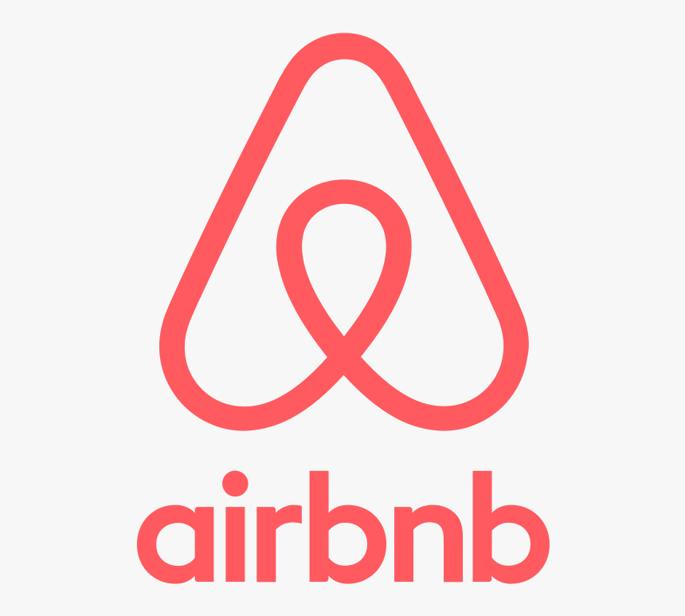

# AirBnB clone - Web static

This README provides an overview of the HTML and CSS implementation for the Airbnb replica project. The objective is to closely mimic the design and appearance of the real Airbnb website. By following the structured HTML layout and replicating the CSS styling, this project aims to create a visually similar experience.

## HTML Structure
The project follows a structured HTML layout to ensure semantic markup and better accessibility. It includes the main sections and components found on the Airbnb website. 

## CSS Styling
The CSS files are responsible for styling the HTML elements to replicate the visual design of the Airbnb website. The goal is to match the colors, fonts, layouts, and other styling aspects. 

#### Concepts

- [AirBnB clone](https://intranet.aluswe.com/concepts/74)

## Resources
#### Read or watch:

- [Learn to Code HTML & CSS (until “Creating Lists” included)](https://intranet.aluswe.com/rltoken/9P868D9X6hKF-iPeuTjUMA)
- [Inline Styles in HTML](https://intranet.aluswe.com/rltoken/3w80rVNNceP13m7D52ma3Q)
- [Specifics on CSS Specificity](https://intranet.aluswe.com/rltoken/miNTDX58opEBx0EbOWPySw)
- [CSS SpeciFishity](https://intranet.aluswe.com/rltoken/JYH8gnHJXb7aF-y4xwFW4A)
- [Introduction to HTML](https://intranet.aluswe.com/rltoken/Jrc0YlYYAry_aRJBZB5v2Q)
- [CSS](https://intranet.aluswe.com/rltoken/mq0A1qZJs8J0SE5xyxODzg)
- [MDN](https://intranet.aluswe.com/rltoken/8AWCJcUwO2UK5FFUb7G-iw)
- [center boxes](https://intranet.aluswe.com/rltoken/CWYMpBgaImw4SPgfibG2eQ)

# Author: Long Maker Long Deng
Email: l.deng@alustudent.com
